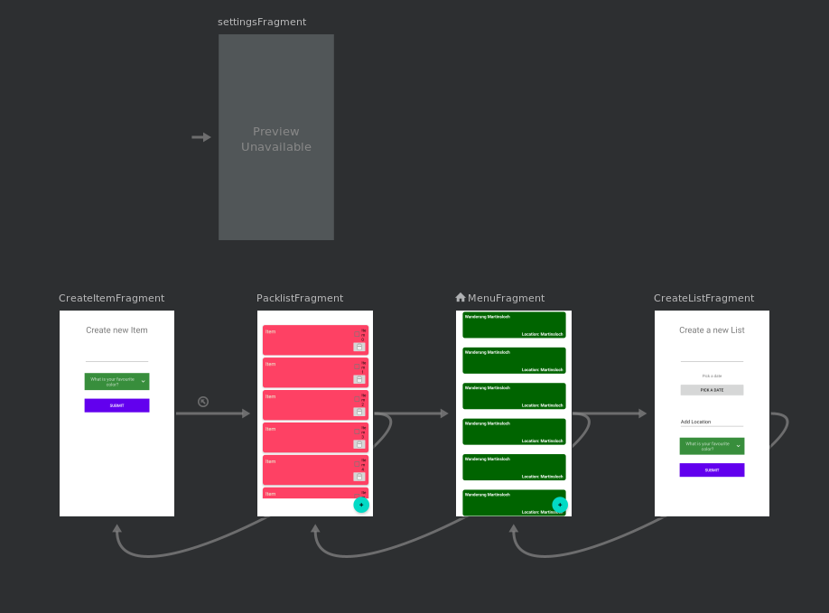

# packing-list
Basic packing-list app that implements the recommended architecture.
We use LiveData, ViewModel, Repository and Room to enable a Flow of Data for Automatic UI Updates (Reactive UI).

Technische Anforderungen:
 - Lokale Persistenz mittels Datenbank (Roomm bzw. SQLite)
 - Lokale Persistenz mittels Preferences oder Dateisystem
 - Verwendung von nicht im Modul behandelten Bibliotheken /
   Frameworks (https://github.com/skydoves/PowerSpinner)
 - Erstellung von sinnvollen Unit-Tests

