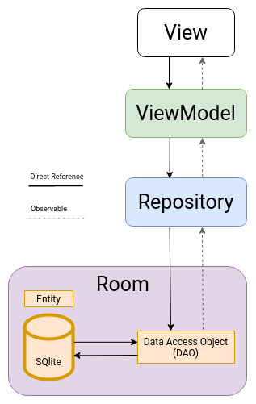

# packing-list

This is a notes app. 📝

That's it. :penguin:

It supports ᑭᒪᗩIᑎ丅E᙭丅. ✅

# App Architecture

Based on LiveData, ViewModel, Repository and Room to ease a Flow of Data for Automatic UI Updates (Reactive UI).

# # Navigation Controller
The Navigation Controller is a puissant tool in the Android developer's arsenal, allowing for facile management of an application's state transitions. It is not _yet_ deprected, but don't worry, that will happen soon enough.

